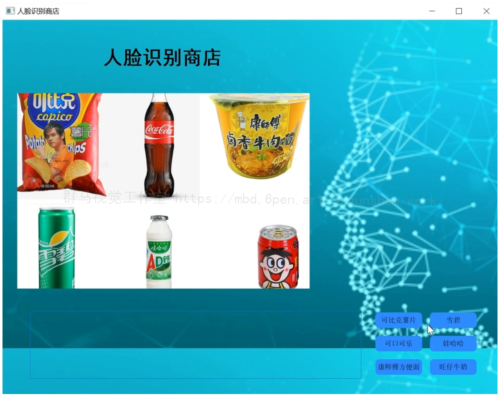
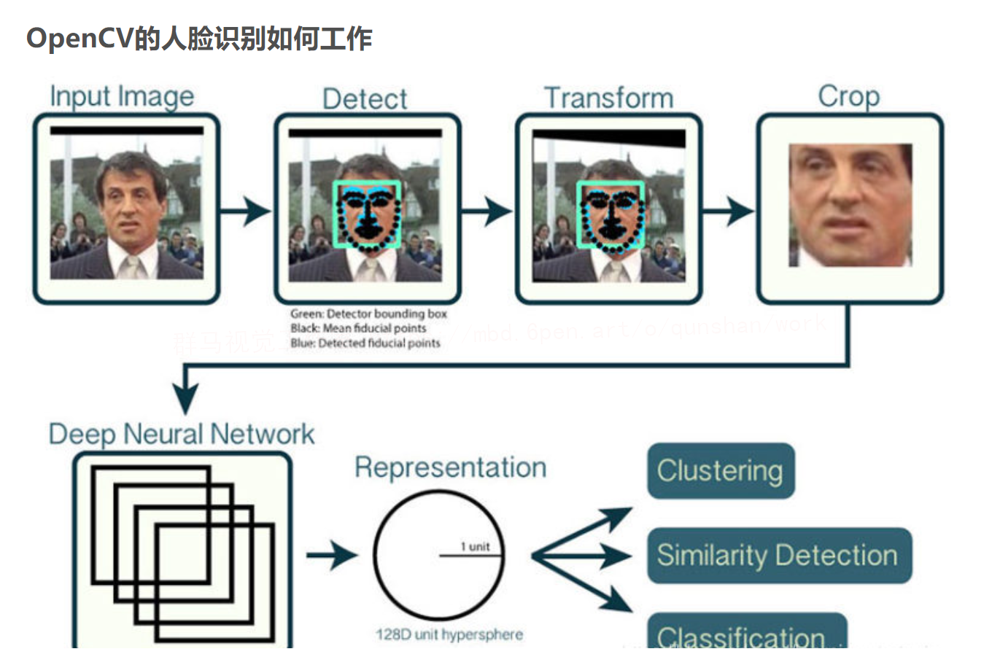

# 1.模块功能介绍
#### 实现人脸识别模块、人脸登录与注册功能、商店显示和用户余额页显示功能
用GUl图形界面实现(pyqt)语言python windows下软件pycharm
1.用户登录模块:刷脸登录
2.注册模块:拍照截取与对齐上传人脸信息录编入用户的余额和号
3.登陆成功后，进入商店页面
4.用户进入商店有余额和商店商品价格
注册录入:人脸截取与对齐（ opencv+dlib):
利用opencv 或dlib的检测视频人脸并截取。并输入编号和余额。

# 2.视频演示
[[项目分享]基于OpenCV的人脸识别自助商店（源码＆部署视频）_哔哩哔哩_bilibili](https://www.bilibili.com/video/BV1ot4y1j72F/?vd_source=bc9aec86d164b67a7004b996143742dc)


# 3.效果展示




# 4.第三方包的安装


### opencv 的安装，输入：pip install opencv-python。

注：numpy与OpenCV绑定安装，无需自己输入命令。

### pillow的安装，输入： pip install pillow

注：pillow为图像处理包。

### contrib的安装，输入：pip instal opencv-contrib-python

# 5.OpenCV人脸识别的原理：

您可能想知道本教程与[参考的博客方法](https://mbd.pub/o/bread/Y5WWmply)的不同？
好吧，请记住，dlib人脸识别帖子依赖于两个重要的外部库：
（1）dlib（显然）
（2）face_recognition（这是一组易于使用的人脸识别实用程序，包含dlib）
虽然我们使用OpenCV来进行人脸识别，但OpenCV本身并不负责识别人脸。
在今天的教程中，我们将学习如何将深度学习和OpenCV一起应用（除了scikit-learn之外没有其他库）：
（1）检测人脸
（2）计算128维人脸嵌入以量化人脸
（3）在嵌入之上训练支持向量机（SVM）
（4）识别图像和视频流中的人脸
所有这些任务都将通过OpenCV完成，使我们能够获得“纯粹的”OpenCV人脸识别管道（pipeline）。
为了构建我们的OpenCV人脸识别管道，我们将在两个关键步骤中应用深度学习：
[模仿该博客](https://afdian.net/item?plan_id=38de18bc60c411edb9c452540025c377)，应用人脸检测，检测人脸在图像中的存在和位置，但不识别它
提取量化图像中每个面部的128维特征向量（称为“嵌入”）
我之前已经讨论过OpenCV的人脸检测是如何工作的，所以如果你以前没有检测到人脸，请参考：



# 6.人脸姓名识别代码实现：

```
import numpy as np
import cv2

# 人脸识别分类器
faceCascade = cv2.CascadeClassifier(r'C:\python3.7\Lib\site-packages\cv2\data\haarcascade_frontalface_default.xml')

# 识别眼睛的分类器
eyeCascade = cv2.CascadeClassifier(r'C:\python3.7\Lib\site-packages\cv2\data\haarcascade_eye.xml')

# 开启摄像头
cap = cv2.VideoCapture(0)
ok = True

while ok:
    # 读取摄像头中的图像，ok为是否读取成功的判断参数
    ok, img = cap.read()
    # 转换成灰度图像
    gray = cv2.cvtColor(img, cv2.COLOR_BGR2GRAY)

    # 人脸检测
    faces = faceCascade.detectMultiScale(
        gray,
        scaleFactor=1.2,
        minNeighbors=5,
        minSize=(32, 32)
    )

    # 在检测人脸的基础上检测眼睛
    for (x, y, w, h) in faces:
        fac_gray = gray[y: (y+h), x: (x+w)]
        result = []
        eyes = eyeCascade.detectMultiScale(fac_gray, 1.3, 2)

        # 眼睛坐标的换算，将相对位置换成绝对位置
        for (ex, ey, ew, eh) in eyes:
            result.append((x+ex, y+ey, ew, eh))

    # 画矩形
    for (x, y, w, h) in faces:
        cv2.rectangle(img, (x, y), (x+w, y+h), (255, 0, 0), 2)

    for (ex, ey, ew, eh) in result:
        cv2.rectangle(img, (ex, ey), (ex+ew, ey+eh), (0, 255, 0), 2)

    cv2.imshow('video', img)

    k = cv2.waitKey(1)
    if k == 27:    # press 'ESC' to quit
        break

cap.release()
cv2.destroyAllWindows()
```
# 7.刷脸购物相关研究：
#### 技术原理：人脸特征模板识别

支付宝的人脸识别技术采用在该领域广泛应用的区域特征分析算法，它融合了计算机图像处理技术与生物统计学原理于一体，利用计算机图像处理技术从视频中提取人像特征点，利用生物统计学的原理进行分析建立数学模型，即人脸特征模板。利用已建成的人脸特征模板与被测者的人的面像进行特征分析，根据分析的结果来给出一个相似值。通过这个值即可确定是否为同一人。

说得更加技术宅一些，阿里巴巴提供的材料显示的技术原理是：这个系统人脸识别中各个环节全部基于深度神经网络技术（CNN），通过人脸检测、关键点定位、特征提取和特征比对等技术手段，从图像或视频中发现，定位人脸进而识别出人脸所属的人的身份。

据称该系统已累计处理10亿人脸图像数据。

支付宝人脸识别操作流程：

人脸照片由用户上传到支付宝系统，经过系统分析认证，然后“绑定”自己的支付账户。每次支付只要在下单购买后，让支付系统扫描用户脸部并确认身份，即可完成支付。

为什么选择人脸支付而不是现在应用更广泛的指纹识别呢？支付宝给出的答案是由于操作方式是非接触式，比指纹等支付更有利于打消用户对个人隐私的顾虑。

未来应用：无需携带现金和银行卡，经过收银机1秒内即可实现刷脸支付

马云的“刷脸支付”给未来生活支付方式带来了全新变革，根据阿里巴巴应用此技术的前景，有了扫脸支付系统，人们无需携带现金和银行卡，更不需要记忆各种密码或账号，用户只需要用手机前置摄像头拍摄照片上传到多核处理系统上完成注册，系统抽取人脸特征，进行处理之后注册成功。当在线下购物时，用户只要走到收银机前就可在1秒内实现人脸识别完成支付。

其实类似的脸部识别技术在全球技术研发中并不罕见，去年芬兰一家叫做Uniqul的公司已经在赫尔辛基开始了“刷脸支付”的实践应用，并按照服务覆盖面积收取不同价格的使用费用。而我国中科院的生物识别与安全技术研究中心也在研究基于人脸识别的支付方式，其实该识别技术已经于2008年北京奥运会时使用过。


# 8.系统的整合：
上面的模型训练好了，但对于我们来说它的作用就只是知道了其准确率还行，其实深度学习的目的最重要还是应用，是时候用上面的模型做点自定义的部分，背景图可以自己选择，避免了出现网红UI界面的情况出现（避免了搭边的时候撞衫）。可不可以用上面的模型识别下自己表达的情绪呢？不如做个系统调取摄像头对实时画面中的表情进行识别并显示识别结果，既能可视化的检测模型的实用性能，同时使得整个项目生动有趣激发自己的创造性，当你向别人介绍你的项目时也显得高大上。这里采用PyQt5进行设计，首先看一下最后的效果图，完整的项目如下：
下图[完整源码&环境部署视频教程&自定义UI界面&操作指南](https://s.xiaocichang.com/s/3877ca)

参考博客[《Python基于OpenCV的人脸识别自助商店（源码＆部署视频）》](https://mbd.pub/o/qunma/work)


# 9.参考文献
**1.[期刊论文]**基于CNN和SVM的人脸识别系统的设计与实现

**期刊：**《计算机与数字工程》 | 2021 年第 002 期

**摘要：**针对人脸识别在实际应用中存在姿态变化、表情、遮挡等问题,研究了结合支持向量机(SVM)分类的卷积神经网络(CNN)人脸识别算法,设计并实现了人脸识别系统.系统首先使用CNN提取人脸特征向量,再将特征向量通过SVM进行分类.测试结果表明,系统在训练样本充分时面对人脸姿态变化、表情、遮挡等情况下都具有较好的性能,识别率在95％以上,能满足一般的人脸识别需求.

**关键词：**人脸识别；卷积神经网络；支持向量机；深度学习

**链接：**[https://www.zhangqiaokeyan.com/academic-journal-cn_computer-digital-engineering_thesis/0201288867559.html](https://link.zhihu.com/?target=https%3A//www.zhangqiaokeyan.com/academic-journal-cn_computer-digital-engineering_thesis/0201288867559.html%3Ffrom%3Dlzhh-0-2-1-4p-24299)

---------------------------------------------------------------------------------------------------

**2.[期刊论文]**基于Python语言的视频监控人脸识别系统的实现

**期刊：**《集成电路应用》 | 2021 年第 001 期

**摘要：**基于调用人脸识别接口实现鉴别功能具有使用方便和识别率高的特点,阐述百度和旷世人脸识别接口的调用方法,并使用Python语言进行了测试验证,从而取得较好的实用价值。

**关键词：**人脸识别；接口；活体检测；Python

**链接：**[https://www.zhangqiaokeyan.com/academic-journal-cn_application-ic_thesis/0201288862812.html](https://link.zhihu.com/?target=https%3A//www.zhangqiaokeyan.com/academic-journal-cn_application-ic_thesis/0201288862812.html%3Ffrom%3Dlzhh-0-2-1-4p-24299)

---------------------------------------------------------------------------------------------------

**3.[期刊论文]**图像降噪和增强对人脸识别系统识别性能的影响

**期刊：**《刑事技术》 | 2021 年第 001 期

**摘要：**目的 研究图像降噪和图像增强方法 对人脸识别系统识别性能的影响,以期为人脸识别系统应用过程中的图像处理方法 选取提供理论指导和技术方案.方法 收集33起人像鉴定领域实际案例中的人脸图像素材,研究以高斯滤波和小波变换为代表的图像降噪技术以及具有边缘保持和小波变换特性的单帧图像超分辨率增强技术对人脸识别系统识别性能的影响,并对不同图像处理方法 对人脸识别性能的影响进行量化比较分析.结果 本文研究的图像降噪技术均显著提高了人脸识别系统的识别准确性,而图像增强技术虽然提高了人脸图像显示效果,但对人脸识别系统的识别性能无正向促进作用.此外,高斯模糊图像处理的图像降噪方法 虽然简单,但与本文研究的其他方法 比较,其在人脸识别系统识别性能改善方面效果最显著.结论 人脸图像质量对人脸识别系统的识别性能具有显著影响,可以通过图像处理技术改善人脸图像质量进而提高人脸识别系统的识别准确性.其中,图像降噪处理可以显著提高人脸识别系统的识别性能,且比图像增强技术更适合于实际人像鉴定应用中的人脸识别系统识别性能增强.

**关键词：**人像鉴定；人脸识别；图像降噪；图像增强；人脸识别系统

**链接：**[https://www.zhangqiaokeyan.com/academic-journal-cn_forensic-science-technology_thesis/0201288649785.html](https://link.zhihu.com/?target=https%3A//www.zhangqiaokeyan.com/academic-journal-cn_forensic-science-technology_thesis/0201288649785.html%3Ffrom%3Dlzhh-0-2-1-4p-24299)

---------------------------------------------------------------------------------------------------

**4.[期刊论文]**RGB-D防伪人脸识别系统设计

**期刊：**《数字技术与应用》 | 2021 年第 002 期

**摘要：**为解决常用的基于普通可见光图像的人脸识别技术常面临的缺陷,如抵抗照片、视频等伪造人脸攻击能力较弱、在光照不理想(如弱光照、侧强光)时所成的RGB图像质量差、识别对象不配合、识别姿态不理想等,所以本项目基于此设计了RGB-D防伪人脸识别系统,该系统数据基于深度图的RGB-D人脸识别,并使用云服务器进行数据处理,可以很好的解决因光照条件不足引起的识别失败问题,具有更好的识别准确率.

**关键词：**RGB-D；防伪；人脸识别

**链接：**[https://www.zhangqiaokeyan.com/academic-journal-cn_digital-technology-application_thesis/0201290469876.html](https://link.zhihu.com/?target=https%3A//www.zhangqiaokeyan.com/academic-journal-cn_digital-technology-application_thesis/0201290469876.html%3Ffrom%3Dlzhh-0-2-1-4p-24299)

---------------------------------------------------------------------------------------------------

**5.[期刊论文]**基于Java的图书馆人脸识别系统设计与实现

**期刊：**《科技创新与应用》 | 2021 年第 007 期

**摘要：**文章提出了一种基于彩色图像的24位面部识别方法,图像处理的主要部分在软件中占据非常重要的位置,图像质量直接影响位置确定和识别精度.通过背光补偿,高斯平滑和二进制进行判别.在判别之前,经过互补光对图像施行处置,而后通过肤色得到大致的人脸.最后,依照面部固有眼睛的对称性断定面部,提升了定位和判别精度.最终该系统应用与图书馆人脸识别,并有很好的效果

**关键词：**Java；MySQL；人脸识别系统

**链接：**[https://www.zhangqiaokeyan.com/academic-journal-cn_technology-innovation-application_thesis/0201286594971.html](https://link.zhihu.com/?target=https%3A//www.zhangqiaokeyan.com/academic-journal-cn_technology-innovation-application_thesis/0201286594971.html%3Ffrom%3Dlzhh-0-2-1-4p-24299)

---------------------------------------------------------------------------------------------------


---
#### 如果您需要更详细的【源码和环境部署教程】，除了通过【系统整合】小节的链接获取之外，还可以通过邮箱以下途径获取:
#### 1.请先在GitHub上为该项目点赞（Star），编辑一封邮件，附上点赞的截图、项目的中文描述概述（About）以及您的用途需求，发送到我们的邮箱
#### sharecode@yeah.net
#### 2.我们收到邮件后会定期根据邮件的接收顺序将【完整源码和环境部署教程】发送到您的邮箱。
#### 【免责声明】本文来源于用户投稿，如果侵犯任何第三方的合法权益，可通过邮箱联系删除。